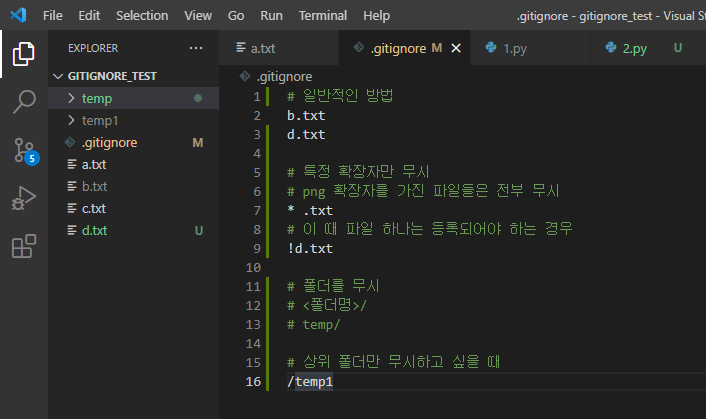
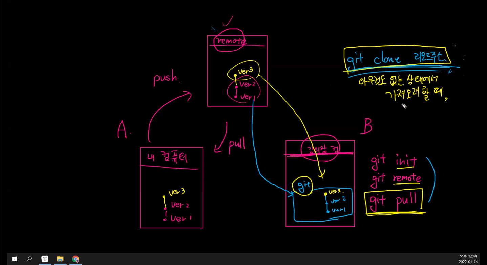
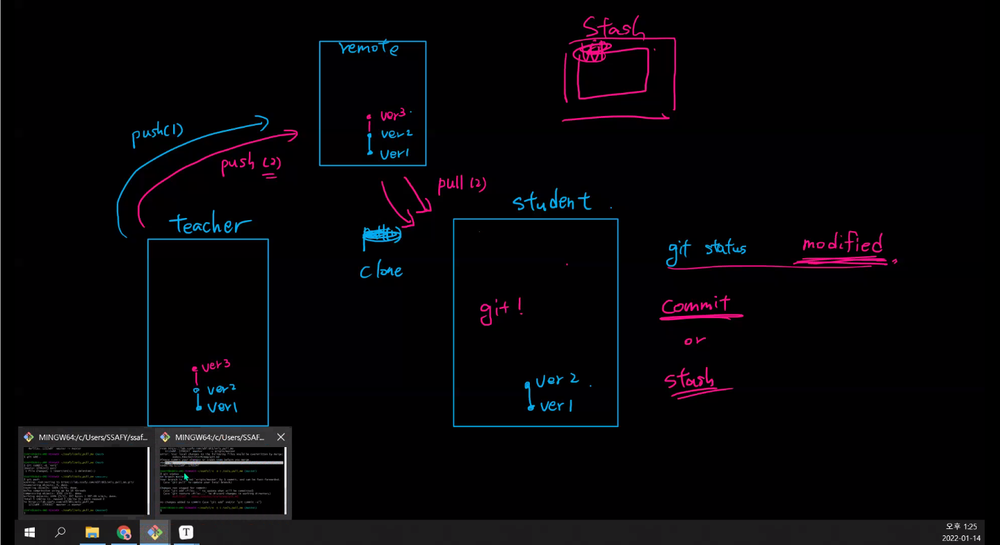

Git


### Git이란?

* 분산 버전 관리 시스템(DVCS : Distribueed version Control System)
* 소스코드의 버전을 관리하고 이력도 관리할 수 있다.
* 버전 : 컴퓨터 소프트웨어의 특정 상태
* 관리 : 어떤 일의 사무, 시설이나 물건의 유지,개량
* 프로그램 : 컴퓨터에서 실행될 때 특정 작업을 수행하는 일련의 명령어들의 모음

---

### 준비하기

1. 윈도우에 git을 설치한다.(git bash설치)
2. 초기 설치 완료 후 로컬 컴퓨터에 Author정보를 설정해야한다.

```bash
$ git config --global user.email 유저이메일
$ git config --global user.name 유저이름

$ git config --global -l :설정 값을 확인하는 명령어
```

---

### 로컬 저장소

#### 1. 저장소 초기화

```bash
$ git init
~/ssafy (master)	//master브랜치명 확인으로 git 관리여뷰 확인
```

| Working Directory                                            | Staging Area                                                 | Local Repository (commit)                      |
| ------------------------------------------------------------ | ------------------------------------------------------------ | ---------------------------------------------- |
| 실제 작업되는 공간 <br />변경 설정이 나타나면 이곳에서 파일이 등록 | commit되기 전 임시로 파일들이 보여지는 곳<br /> 이곳에서 commit 되어도 되는지 파일을 확인 | git으로 관리되는 파일들의 버전들이 저장되는 곳 |

#### 2. 상태를 확인

```bash
$ git status 	// WD, SA의 상태를 확인하기 위한 명령어
```

* Untracked
  * git으로 관리되지 않았던 파일이 등록된 경우
  * WD에서 해당 단어를 확인할 수 있다.

* Tracked

  * New file : git으로 관리되지 않았던 파일이 Staging Area에 등록되었을 때 확인할 수 있다.

  * modified  : git으로 관리하는데 수정된 파일이 Staging Area에 등록되었을 때 --> 빨간색

  * unmodified : --> 녹색

#### 3. gitignore

> 주의 : gitignore에 먼저 등록하고 add를 하자
>
> 미리 add되어 있으면 gitignore
>
> (Stage Area에서 제거할 때 : git restore --staged <파일명>

* 문제점 : 관리하기 싫은 file도 git add . 를 하면 같이 Staging Area에 등록된다.
* gitignore : 관리하기 싫은 file목록을 작성하여 Staging Area에 접급하기 못하게 관리
* 프로젝트에 관련 없는 파일
  * 민감한 개인 파일이나
  * 개인 컴퓨터 설정파일(OS에서 활용되는 파일)
  * IDE 환경 설정 파일
  * 가상환경 폴더 및 파일(venv)
* `gitignore`파일을 생성 (확장자는 따로 없음)
  * 제외하고 싶은 파일을 등록
  * 파일명을 적어주면 끝
* gitignore.io를 이용하면 편하게 gitignore파일을 작성할 수 있다.
  * 단, 우리가 생성한 파일은 우리가 직접 등록해야한다.(단순 참고용도인 파일)




#### 4. Commit을 위한 준비

```bash
$ git add 파일명
$ git add .		//현재 폴더 내에 있는 변경/추가된 파일 모두를 등록
```

* Working Directory에서 Staging Area로 관리 파일들을 이동시키는 명령어
* Staging Area에서 관리 대상에 대한 판단을 하고 Commit여부를 결정

#### 5. Commit 하기

```bash
$ git commit -m '커밋 메시지'		//유의미한 내용으로 커밋 메시지 작성
```

* 버전 이력을 확정짓는 명령어
* 해당 시점의 파일 변경된 내용을 스냅샷으로 기록해 남긴다.

#### 6. Commit 이력 확인하기

```bash
$ git log	
$ git log --online		//한 줄로 축약해서 보여줌
$ git log -p			//파일의 변경 내용도 같이 보여줌
$ git log -숫자		   //숫자만큼만 보여줌
```

---

### 원격 저장소(Remote Repository)

* github / gitlab 

#### 1. 원격 저장소 등록

* 사용하기 위해서는 로컬에 원격 저장소의 url주소를 등록해야함

  ```bash
  $ git remote add <저장소별명(origin)> <저장소주소>
  ```

* 등록된 원격 저장소 주소를 확인하는 방법

  ```bash
  $ git remote -v	
  ```

* 저장소 삭제

  ```bash
  $ git remote rm	<저장소별명>
  ```

#### 2. 원격저장소에 commit 내용 보내기

* 로컬에 저장된 commit을 원격 저장소로 전달하여 분산 버전 관리를 완성하는 부분

  ```bash
  $ git push <저장소별명> <브랜치명>
  $ git push -u origin master
  ```

  * -u : set-up-stream의 shortcut형태이고 저장소 별명과 브랜치 명을 설정

---

### 원격 저장소에서 내려받기

#### 1. git clone

* git init, git remote, add 동작이 포함된 내려받기 명령어
* 아무것도 없는 상태일 때 사용한다.
* `git clone <리모트레포주소>`

#### 2. git pull

* remote 서버의 정보를 내려받는 명령어
* git이 적용되어 있어야 한다. (.git폴더가 존재해야함)
* remote 정보가 등록되어 있어야 한다.
* `git pull <리모트별명> <브랜치명>`


### 기타

#### submodule warning  메시지가 떴다

1. 어떤 폴더가 submodule인지 확인한다.

2. 해당 폴더로 찾아가서 .git폴더를 제거한다.

3. 이미 staging area에 올라간 상태라면

4. `git rm -rf cached <폴더명>` 으로 해당 폴더를 Working directory로 내린다

5. git status로 다시 상태 체크

6. git add로 staging area로 다시 올린다.

7. 그리고 다시 git status로 staging에 올라온 상태를 파악하고

8. git commit을 한다

   * 싸피 1학기 과정에서는 submodule 사용 계획 x

   * CLI환경에서 master가 보이면 git init을 하지 않는게 좋다.


### Git을 이용한 버전 관리

* 버전관리는 원격저장소(github) 기준

---

### Git의 3가지 공간

1. Working Directory
   * git add

2. Stage Area
   * git commit

3. Local Repository

   

   

---

### Git - Github 사용법

#### git

1. github회원가입 및 로그인
2. settings에서 repository --> master변경
3. repository 에서 new 클릭 --> repositort이름 설정
4. git init
5. git add readme.md
6. git add . (현재 위치에 있는 모든 파일을 add)
7. git commit -m '메시지' 

   ( git status : git 상태 확인

​	 git log : 버전 확인)

--- 여기까지 로컬저장소(git)에서 수행

#### github

8. git remote add <remote별명> <remote 저장소 url> 
   * git remote add origin https://gitaddress.com
9. git push -u origin master

---

### Git 상태

* Untracked

  : 처음으로 관리되는 대상 --> 빨간색

  : Working Directory에 있는 상태 (Staging Area에 올라가기 전 상태)

* Tracked

  : 관리되고 있는 대상 (Staging Area에 올라간 상태)

  * modified --> 빨간색
  * unmodified --> 녹색


---




